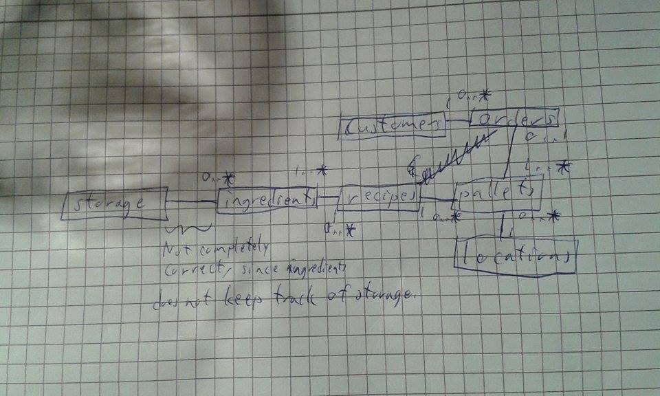

# MyEDA216

## EDA216, Databases
Kevin Andersson
dat13kan@student.lu.se

Introduction
============

The aim of this project was to create a database for factories owned by
the fictional company “Krusty Kookies Sweden AB”, which produce and
distribute cookies. Furthermore, a program was to be created for the
production, blocking and searching of pallets in the factory/factories,
which was to perform these tasks using the constructed database.

The outline for how the database was to be structured was outlined in an
assignment description designed to be partially vague, making it part of
the challenge of creating a functioning database.

Requirements
============

1.  The computerized system must be flexible and be able to meet our
    demands on usability and reliability.

2.  All ingredients shall be stored in one location.

3.  All pallets containing a product that have been produced during a
    specific time interval should be able to be blocked (at the same
    time).

4.  The pallet number, product name, and date and time of production is
    registered in the database.

5.  The pallet number is unique.

6.  At any time, we must be able to check how many pallets of a product
    that have been produced during a specific time.

7.  When a pallet is produced, the raw materials storage must be
    updated.

8.  We must be able to check the amount in store of each ingredient, and
    to see when, and how much of, an ingredient was last delivered into
    storage.

9.  As we mentioned earlier, pallets in the deep-freeze storage may be
    blocked.

10. We must be able to trace each pallet. For instance, we need to see
    all information about a pallet with a given number (the contents of
    the pallet, the location of the pallet, if the pallet is delivered
    and in that case to whom, etc.). We must also be able to see which
    pallets that contain a certain product and which pallets that have
    been produced during a certain time interval.

11. We need to find out which products that are blocked, and also which
    pallets that contain a certain blocked product.

12. Finally, we must be able to check which pallets that have been
    delivered to a given customer, and the date and time of delivery.

13. Orders must be registered in the database.

14. When the loading bill has been printed, the data regarding delivered
    pallets must be updated with customer data and date of delivery.

Outline of the system
=====================

Database manager: Java Database Connectivity (JDBC)\
\
Programs:

-   KrustyKookies.java

    -   Initiates the database program and the ProjectGUI

-   Database.java

    -   Creates a connection to the actual database and contains all of
        the interactions with the database.

-   ProjectGUI.java

    -   Creates the GUI elements, including UserLoginPane,
        ProductionPane, PalletSearchPane and BlockingPane. Also setups
        the window used for the panes and handles closing of the window.

-   UserLoginPane.java

    -   The class used for the first window visible in the program,
        which welcomes the user and asks for login. Extends
        BasicPane.java.

-   ProductionPane.java

    -   Window for producing new pallets, which is by specifying a
        candy-type, followed by pushing a button.

-   PalletSearchPane.java

    -   Window for searching for pallets. Searching can either be donne
        through specification of cookie-type and time-interval, or
        through customer-id.

-   BlockingPane.java

    -   Window which allows for blocking of pallets of a specified
        cookie-type during a time-interval.

-   BasicPane.java

    -   The ground for the other pane classes. Is not used by itself.

-   ButtonAndMessagePanel.java

    -   Class with only a single method, which is used to assign
        buttons, messages and actionhandlers to one another.

-   InputPanel.java

    -   A GUI panel which contains a number of text fields on top of
        each other. Each text field has a label.

-   CurrentUser.java

    -   Keeps track of the username for the currently logged in user.

-   Pallet.java

    -   Contains attributes concerning pallets.

E/R diagram
===========



Relations
=========

-   customers(name, address), primary(name)

    -   FD1: name &rarr; address\
        One FD: BCNF

-   storage(name, unit, amount, last\_date, last\_amount)\
    primary(name),\
    foreign(name) references ingredients(name)

    -   FD1: name &rarr; unit, amount, last\_date, last\_amount\
        One FD: BCNF

-   recipes(name)\
    primary(name)

    -   Obviously BCNF

-   ingredients(name, unit, amount, cookie\_name)\
    primary(name, cookie\_name)\
    foreign(cookie\_name references recipes(name)

    -   FD1:name, cookie\_name &rarr; amount, unit\
        Only one FD, relation in BCNF

-   orders(id, amount, delivery\_date, customer\_id, product\_name)\
    primary(ID)\
    foreign(customer\_id references customers(id))\
    foreign(product\_name) references recipes(name)

    -   FD1:id &rarr; amount, delivery\_date, customer\_id,
        product\_name\
        Only one FD, relation in BCNF

-   pallets(id, orderId, product\_name, location, production\_timestamp,
    blocked)\
    primary(id)\
    foreign(product\_name) references recipes(name),\
    foreign(location) references locations(name),\
    foreign(orderId) references orders(id)

    -   FD1:id &rarr; orderId, product\_name, location,
        production\_timestamp, blocked

    -   FD2: production\_timestamp, product\_name &rarr; blocked\
        \
        blocked is not a superkey of id, meaning that the relation is
        not in BCNF. However, this is deemed fine since FD2 is only
        relevant to us when connected to a pallet. As this is the case,
        we are satisfied with a lower normal form (2NF).

-   locations(name)\
    primary(name) obviously BCNF

SQL statements
==============

``` {.SQL}
DROP TABLE IF EXISTS customers;
DROP TABLE IF EXISTS orders;
DROP TABLE IF EXISTS recipes;
DROP TABLE IF EXISTS pallets;
DROP TABLE IF EXISTS locations;
DROP TABLE IF EXISTS ingredients;
DROP TABLE IF EXISTS storage;
DROP TABLE IF EXISTS users;

CREATE TABLE users (
    name varchar(20),
    primary key (name)
);

CREATE TABLE customers (
    id varchar(20),
    address varchar(20),
    primary key (id)
);

CREATE TABLE orders (
    id integer,
    amount integer not null check (amount > 0),
    delivery_date date,
    customer_id varchar(20),
    product_name varchar(20),
    primary key (id),
    foreign key (customer_id) references customers(id),
    foreign key (product_name) references recipes(name)
);

CREATE TABLE recipes (
    name varchar(20),
    primary key (name)
);

CREATE TABLE pallets (
    id integer,
    orderId integer,
    product_name varchar(20),
    location varchar(20),
    production_timestamp timestamp,
    blocked boolean,
    primary key (id),
    foreign key (product_name) references recipes(name),
    foreign key (location) references locations(name),
    foreign key (orderId) references orders(id)
);

CREATE TABLE locations (
    name varchar(20),
    primary key(name)
);

CREATE TABLE ingredients (
    name varchar(20),
    unit varchar(5),
    amount integer check(amount > 0),
    cookie_name varchar(20),
    primary key(name, cookie_name),
    foreign key(cookie_name) references recipes(name)
);

CREATE TABLE storage (
    name varchar(20),
    unit varchar(5),
    amount integer check(amount > 0),
    last_date date,
    last_amount integer check(last_amount > 0),
    primary key(name),
    foreign key(name) references ingredients(name)
);
```

Quick pointers
==============

-   Most actions require a login to be used. Use KOOL as login to access
    program operations.

-   When searching for pallets using cookietype, the date must be
    inserted using the following format: YYYY-MM-DD HH:MM:SS. This is
    also true for blocking

-   searching for pallets for a certain customer does not require
    insertion of date.


